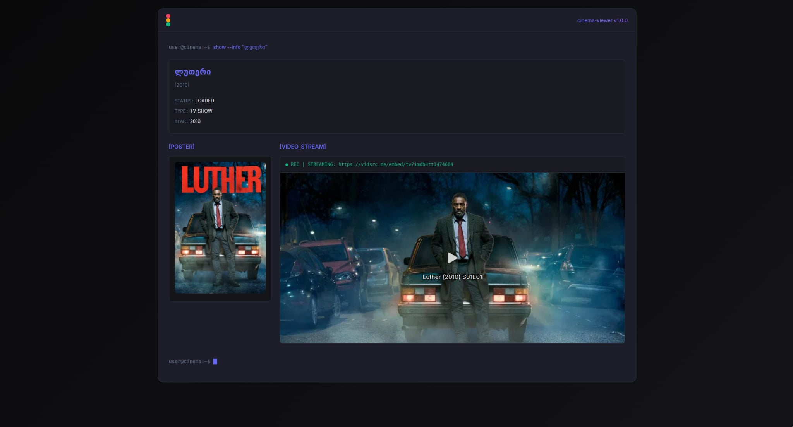

# AD Free English Movie and TV series Center

## First look

**Landing page**  
  

**Series**


**Each movie**  


---

### Get started

```sh
git clone https://github.com/Ka10ken1/mykadri-scraper
cd mykadri-scraper
```

```sh
docker compose up --build
```

---

### Overview

```
mykadri-scraper/
├── cmd/
│   └── main.go               # Entry point
├── internal/
│   ├── api/                  # HTTP handlers and routes
│   │   ├── handlers.go
│   │   └── router.go
│   ├── models/               # MongoDB interaction
│   │   └── models.go
│   └── scraper/              # Scraping logic
│       └── scraper.go
├── web/                      # Static frontend
│   ├── index.html
│   ├── style.css
│   ├── api.js
│   ├── app.js
│   ├── index.js
│   └── template/
│       └── movie.html
├── Dockerfile
├── docker-compose.yaml
├── go.mod
├── go.sum
└── README.md
```

---

### .env file (for local development)

```
MONGO_URI=mongodb://localhost:27017
MONGO_DB=mykadri
MONGO_COLLECTION=movies
```

---

### API Endpoints

```
GET  /movies            # All movies
GET  /movies/:id        # Single movie by ID
GET  /movie-images      # List of all image URLs
GET  /movie/:id         # HTML page for movie
GET  /                  # Landing page
```

---

### Frontend

- Pure HTML/CSS/JS (no framework)
- Pre-renders movie cards from server
- Uses API via `fetch` in `api.js`

---

### MongoDB Setup (optional without Docker)

If you're not using Docker, make sure you have MongoDB running:

```sh
sudo systemctl start mongod
```

Then run:

```sh
go run ./cmd/main.go
```

---

### Cleanup

```sh
docker compose down -v
```

---

### Notes

- Scraper skips already-inserted movies (based on link)
- Movie page is scraped for a video iframe
- No retries or slowdowns for HTTP 429 to avoid long waits
- Page concurrency is limited to reduce server stress


### Todo
- Integrate full text search engine
- Perfect Scraper
